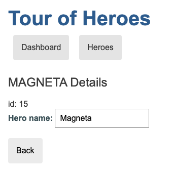
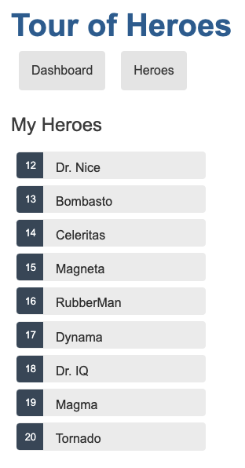

# Angular Tour Of Heroes

## Deployment Information

This project was generated with [Angular CLI](https://github.com/angular/angular-cli) version 17.2.1.

### Development server

Run `ng serve` for a dev server. Navigate to `http://localhost:4200/`. The application will automatically reload if you change any of the source files.

### Code scaffolding

Run `ng generate component component-name` to generate a new component. You can also use `ng generate directive|pipe|service|class|guard|interface|enum|module`.

### Build

Run `ng build` to build the project. The build artifacts will be stored in the `dist/` directory.

### Running unit tests

Run `ng test` to execute the unit tests via [Karma](https://karma-runner.github.io).

### Running end-to-end tests

Run `ng e2e` to execute the end-to-end tests via a platform of your choice. To use this command, you need to first add a package that implements end-to-end testing capabilities.

### Further help

To get more help on the Angular CLI use `ng help` or go check out the [Angular CLI Overview and Command Reference](https://angular.io/cli) page.

## Tutorial Information

This _Tour of Heroes_ tutorial provides an introduction to the fundamentals of Angular and shows you how to:

- Set up your local Angular development environment.
- Use the Angular CLI to develop an application.

The _Tour of Heroes_ application that you build helps a staffing agency manage its stable of heroes. The application has many of the features that you'd expect to find in any data-driven application.

The finished application:

- Gets a list of heroes
- Displays the heroes in a list
- Edits a selected hero's details
- Navigates between different views of heroic data

This tutorial helps you gain confidence that Angular can do whatever you need it to do by showing you how to:

- Use Angular directives to show and hide elements and display lists of hero data.
- Create Angular components to display hero details and show an array of heroes.
- Use one-way data binding for read-only data.
- Add editable fields to update a model with two-way data binding.
- Bind component methods to user events, like keystrokes and clicks.
- Enable users to select a hero from a list and edit that hero in the details view.
- Format data with pipes.
- Create a shared service to assemble the heroes.
- Use routing to navigate among different views and their components.

### Design your new application

Here's an image of where this tutorial leads, showing the Dashboard view and the most heroic heroes:

You can click the Dashboard and Heroes links in the dashboard to navigate between the views.

If you click the dashboard hero "Magneta," the router opens a "Hero Details" view where you can change the hero's name.

Clicking the "Back" button returns you to the Dashboard. Links at the top take you to either of the main views. If you click "Heroes," the application displays the "Heroes" list view.

When you click a different hero name, the read-only mini detail beneath the list reflects the new choice.

You can click the "View Details" button to drill into the editable details of the selected hero.

The following diagram illustrates the navigation options.

Here's the application in action:

